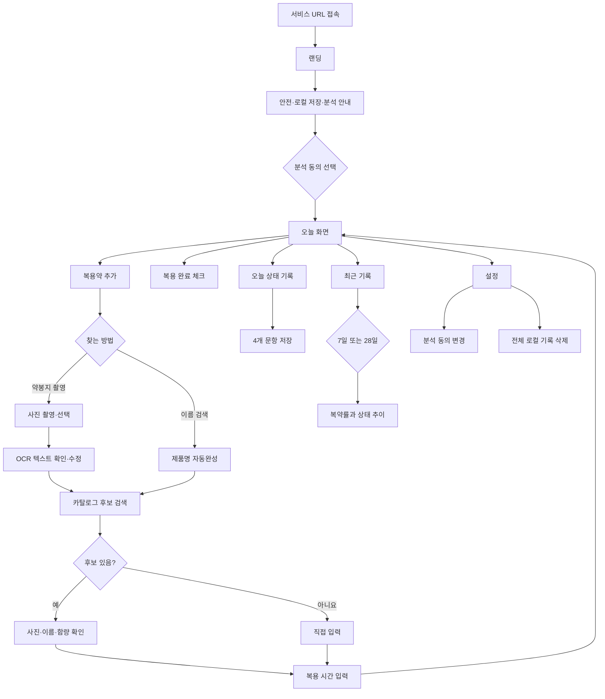

# ADHD 복약 기록 도우미 — 2주 모바일 웹 MVP PRD

> 문서 상태: 개발 착수용 1차 확정안  
> 작성일: 2026-08-10  
> 제작 기간: 10 작업일  
> 제작 주체: 비개발자 프로덕트디자이너 1인 + AI 코딩 도구  
> 제공 형태: 모바일 우선 반응형 웹  
> 배포 목표: Vercel 공개 URL 배포  
> 기준 서비스 규모: 제한된 데이터셋을 완성도 높은 탐색 흐름으로 제공하는 단일 목적 서비스

---

## 1. 프로젝트 정의

### 한 줄 정의

ADHD 약을 복용하는 성인이 약봉지 사진이나 이름 검색으로 자신의 약을 찾고, 오늘의 복약 여부와 상태를 간단히 기록해 최근 7일 또는 28일의 변화를 확인하는 모바일 웹 서비스다.

### 프로젝트 목적

10 작업일 안에 핵심 사용자 흐름을 실제 모바일 브라우저에서 사용할 수 있는 수준으로 구현하고, URL을 통해 테스트 사용자에게 제공한다.

### 해결하려는 문제

- 사용자는 처방받은 약의 긴 공식 제품명과 함량을 직접 입력하기 어렵다.
- 오늘 약을 복용했는지 기억하거나 기록하는 과정이 번거롭다.
- 집중도와 컨디션을 긴 글로 매일 기록하는 것은 부담스럽다.
- 진료 시점에는 최근 복약과 상태 변화를 구체적으로 떠올리기 어렵다.

### 핵심 가설

사용자가 약봉지 사진 또는 이름 일부로 자신의 약을 쉽게 찾고, 하루 1분 안에 복약 여부와 상태를 기록할 수 있다면 진료 전에 최근 경험을 더 구체적으로 정리할 수 있다.

### MVP의 성격

- 실제 사용자가 URL로 접속할 수 있는 배포형 프로토타입이다.
- 의료 서비스나 의약품 식별·진단 도구가 아니다.
- 제한된 테스트 의약품 카탈로그만 제공한다.
- 건강 기록은 현재 브라우저의 로컬 저장소에만 저장한다.
- 사용자 행동 분석에는 건강정보를 전송하지 않는다.

### 완료를 판단하는 핵심 흐름

다음 흐름이 모바일 브라우저에서 중단 없이 작동하면 기능적 MVP를 완료한 것으로 판단한다.

1. 사용자가 서비스 안내와 데이터 저장 방식을 확인한다.
2. 약봉지를 촬영하거나 이름 일부를 검색한다.
3. 제품 사진·이름·함량을 확인하고 복용약으로 등록한다.
4. 오늘 화면에서 복용 완료를 체크한다.
5. 네 개의 상태 문항을 저장한다.
6. 최근 7일 또는 28일 기록을 확인한다.
7. 브라우저를 닫았다 다시 열어도 기록이 유지된다.
8. 사용자가 자신의 기록을 수정하거나 전체 삭제할 수 있다.

---

## 2. 대상 사용자와 사용 맥락

### 주요 사용자

- 처방받은 ADHD 약을 복용하는 성인
- 긴 일기보다 짧은 선택형 기록을 선호하는 사람
- 자신의 약 이름과 함량을 자주 헷갈리는 사람
- 진료 전 최근 복약과 컨디션을 정리하고 싶은 사람

### 우선 테스트 사용자

- 성인 3~5명
- 모바일 웹 사용에 익숙한 사람
- 실제 건강정보 대신 테스트용 정보를 사용하거나 데이터 저장 범위를 이해하고 동의한 사람

### 대표 사용 시나리오

사용자는 모바일 브라우저에서 서비스 URL을 연다. 안전 안내와 로컬 저장 방식을 확인하고 시작한다. 약봉지에서 `콘서타 36mg`이 보이는 부분을 촬영하면 서비스가 텍스트를 읽어 공식 카탈로그의 36mg 제품을 후보로 보여준다. 사용자는 사진과 함량을 확인하고 약을 등록한다. 오늘 화면에서 복용 완료를 체크하고 집중도·컨디션·수면 만족도·불편감을 기록한다. 진료 전에는 최근 7일 또는 28일의 복약 완료율과 상태 추이를 확인한다.

### 사용 원칙

- 로그인 없이 바로 시작할 수 있게 한다.
- 중요한 입력은 한 화면에서 한 가지 과업에 집중한다.
- AI 또는 OCR 결과를 자동으로 확정하지 않는다.
- 제품명과 함량은 사용자가 최종 확인한다.
- 기록이 없는 날을 실패로 표현하지 않는다.
- 의료적 판단이나 행동 변경을 권고하지 않는다.

---

## 3. 범위와 우선순위

### P0 — 반드시 배포할 범위

1. 모바일 랜딩과 최초 안전 안내
2. 분석 데이터 수집 선택 동의
3. 사전 선별 의약품 카탈로그
4. 제품명 부분 검색과 자동완성
5. 약봉지 사진 촬영·선택
6. OCR 텍스트 추출과 카탈로그 후보 검색
7. 제품 사진·이름·함량 확인 후 등록
8. 검색 실패 시 약 이름 직접 입력
9. 복용약 목록·수정·보관 종료
10. 오늘의 복용 완료 체크·취소
11. 하루 한 번의 상태 기록·수정·삭제
12. 최근 7일·28일 기록과 단순 통계
13. 전체 로컬 건강 기록 삭제
14. Mixpanel 익명 행동 이벤트
15. 피드백 진입점
16. 모바일 반응형 QA
17. Vercel 공개 URL 배포

### P1 — P0 완료 후 여유가 있을 때

1. 홈 화면의 서비스 소개 콘텐츠 보강
2. 제품 검색 필터와 최근 검색어
3. 날짜별 기록 상세 화면
4. PWA 홈 화면 추가 안내
5. 피드백 자체 입력 화면
6. 태블릿·데스크톱 레이아웃 보강

### 이번 MVP에서 제외

- 카카오·Google·Apple 로그인
- 이메일·비밀번호 회원가입
- 사용자별 클라우드 동기화
- 여러 기기에서 기록 복원
- App Store·Google Play 배포
- 네이티브 및 웹 푸시 알림
- 알림 안에서 복용 완료 처리
- 전체 국내 의약품 실시간 검색
- 알약 외형만으로 제품 자동 식별
- 외부 의약품 데이터베이스의 실시간 장애 대응
- AI가 생성하는 의료적 해석
- 복용량·복용법·복용 중단 권고
- 의료진 직접 공유
- PDF 또는 이미지 내보내기
- 관리자 페이지
- 커뮤니티·결제·구독

---

## 4. 정보 구조

### 주요 내비게이션

- 오늘
- 최근 기록
- 내 복용약
- 설정

모바일에서는 하단 내비게이션을 사용한다. 약 등록 흐름은 오늘과 내 복용약 화면에서 진입한다.

### 전체 사용자 흐름



---

## 5. 화면 목록

| 번호 | 화면 | 핵심 목적 |
|---:|---|---|
| 1 | 랜딩·최초 안내 | 서비스 가치와 한계 설명 |
| 2 | 오늘 | 복약 체크와 상태 기록의 중심 화면 |
| 3 | 약 찾기 방법 선택 | 촬영 또는 이름 검색 선택 |
| 4 | 사진 OCR | 약봉지 촬영·텍스트 확인 |
| 5 | 약 이름 검색 | 부분 검색과 자동완성 |
| 6 | 후보 결과·등록 확인 | 사진·제품명·함량 확인 |
| 7 | 상태 기록 | 네 개 문항 입력 |
| 8 | 최근 기록 | 7일·28일 복약률과 상태 추이 |
| 9 | 내 복용약 | 등록 약 관리 |
| 10 | 설정 | 저장·분석·삭제·피드백 관리 |

사진 OCR과 후보 결과를 한 화면 또는 바텀시트로 합치면 실제 라우트 수는 8개 안팎으로 유지한다.

---

## 6. 상세 기능 요구사항

### 6.1 랜딩·최초 안내

#### 메시지

```text
오늘의 약과 상태를
간단히 기록해보세요.

약봉지로 약을 찾고,
최근 기록을 진료 전에 확인할 수 있어요.
```

#### 필수 안내

- 이 서비스는 복약 및 상태 기록을 돕는 도구다.
- 진단, 처방 변경, 복용량 추천, 복용 중단 또는 응급 판단을 제공하지 않는다.
- 의료적 결정은 의료진과 상의해야 한다.
- 건강 기록은 현재 브라우저에만 저장된다.
- 브라우저 데이터 삭제, 시크릿 모드, 기기 변경 시 기록이 사라질 수 있다.
- 행동 분석 동의는 선택이며 거부해도 서비스를 이용할 수 있다.

#### 수용 기준

1. 최초 사용자는 안내를 확인한 뒤 서비스를 시작할 수 있다.
2. 분석 동의를 하지 않아도 시작 버튼을 사용할 수 있다.
3. 안내 확인 여부와 분석 동의 여부는 로컬에 저장된다.
4. 설정에서 안내와 분석 동의를 다시 확인·변경할 수 있다.

### 6.2 의약품 카탈로그

#### 범위

- 전체 국내 의약품을 포괄한다고 표현하지 않는다.
- 첫 버전은 콘서타 18mg·27mg·36mg·54mg을 포함해 최소 10개, 최대 20개 품목을 제공한다.
- 카탈로그 포함은 제품 추천이나 치료 적합성 판단을 의미하지 않는다.

#### 데이터 출처

- 식품의약품안전처 의약품 제품 허가정보
- 식품의약품안전처 의약품 낱알식별 정보
- 필요한 경우 일반의약품에 한해 식품의약품안전처 e약은요

#### 품목 데이터

- 품목기준코드
- 공식 품목명
- 검색 결과용 축약 이름
- 함량
- 주성분명
- 제조·수입 업체명
- 공식 낱알 이미지 또는 대체 이미지
- 데이터 기준일
- 데이터 출처

#### 구현 원칙

- 카탈로그와 사용할 수 있는 검색 결과 이미지는 빌드 시 앱에 포함한다.
- 검색할 때마다 식약처 API를 직접 호출하지 않는다.
- 외부 API 장애가 검색 경험을 막지 않게 한다.
- 공식 이미지가 없는 제품에는 임의의 다른 약 사진을 사용하지 않는다.

### 6.3 이름 검색과 자동완성

#### 동작

- 검색어 한 글자부터 후보를 표시한다.
- 제품명 앞부분 일치를 포함 일치보다 우선한다.
- 같은 제품의 함량이 다르면 별도 결과로 표시한다.
- 결과는 최대 10개를 표시한다.
- 결과가 없으면 검색어를 유지한 채 직접 입력으로 전환한다.

#### 정규화 규칙

- 공백 제거
- 한글·영문 대소문자 차이 제거
- `mg`와 `밀리그램`을 동일 단위로 처리
- `OROS` 표기 유무를 검색 순위에 반영
- 괄호 안 성분명을 보조 검색어로 사용

#### 결과 카드

```text
[알약 이미지]
콘서타OROS서방정 36mg
메틸페니데이트염산염 · 한국얀센
[이 약 선택]
```

#### 수용 기준

1. `콘` 입력 시 콘서타 함량별 후보가 표시된다.
2. `콘서타 36mg` 입력 시 36mg 제품이 가장 먼저 표시된다.
3. 사진·제품명·함량·업체명을 한 카드에서 확인할 수 있다.
4. 사용자가 후보를 선택하기 전에는 복용약으로 저장되지 않는다.
5. 결과가 없으면 직접 입력할 수 있다.

### 6.4 약봉지 사진 OCR

#### 동작

- 사용자는 카메라 촬영 또는 사진 보관함 선택을 사용할 수 있다.
- 촬영 전 `약 이름과 함량이 보이게 찍어주세요`라는 가이드를 표시한다.
- 이미지는 전송 전 긴 변 1280px 이하로 축소·압축한다.
- OCR 또는 비전 API는 이미지에서 텍스트만 추출한다.
- 추출한 문자열은 사용자가 확인하고 수정할 수 있다.
- 서비스는 수정된 문자열을 카탈로그 검색에 사용한다.
- OCR이 제품을 직접 생성하거나 확정하지 않는다.
- 이미지는 서버와 서비스 데이터베이스에 영구 저장하지 않는다.

#### 예시

```text
약봉지 촬영
→ OCR: "콘서타 36mg"
→ 정규화: "콘서타36"
→ 후보: "콘서타OROS서방정36밀리그램"
→ 사진·함량·업체명 확인
→ 사용자 선택
```

#### 실패 대응

- 글자를 읽지 못하면 재촬영과 이름 검색을 제공한다.
- `콘서타`만 읽으면 모든 함량을 별도 후보로 표시한다.
- 여러 약 이름을 읽으면 검색어 후보를 나누어 사용자가 하나를 선택하게 한다.
- 네트워크 오류 시 이름 검색으로 즉시 전환한다.
- OCR 결과가 카탈로그에 없으면 직접 입력을 제공한다.

#### 수용 기준

1. `콘서타 36mg` 텍스트가 추출되면 36mg 제품을 첫 후보로 표시한다.
2. OCR 원문을 사용자가 등록 전에 수정할 수 있다.
3. 낮은 신뢰도 또는 검색 실패 시 자동 등록하지 않는다.
4. 사진은 새로고침이나 다음 접속에서 다시 표시되지 않는다.
5. 실패 화면에서 한 번의 동작으로 이름 검색으로 이동할 수 있다.

### 6.5 복용약 등록과 관리

#### 입력 항목

- 제품 또는 직접 입력한 약 이름: 필수
- 복용 시간: 필수, 하루 한 번
- 메모: 선택, 최대 100자

웹 푸시 알림은 제공하지 않는다. 복용 시간은 오늘 화면에서 예정 시각을 보여주고 요약 계산의 기준으로 사용한다.

#### 동작

- 공식 후보를 선택하거나 직접 입력해 등록할 수 있다.
- 직접 입력한 약에는 `직접 입력` 표시를 붙인다.
- 복용 시간과 메모를 수정할 수 있다.
- 복용을 중단한 약은 `보관 종료` 상태로 변경한다.
- 보관 종료 이후 날짜는 복약률 계산의 예정 건수에 포함하지 않는다.
- 과거 기록에는 당시 약 이름을 스냅샷으로 유지한다.

#### 수용 기준

1. 약 이름과 복용 시간이 없으면 저장할 수 없다.
2. 저장 후 오늘 화면과 내 복용약 화면에 표시된다.
3. 브라우저를 닫았다 다시 열어도 등록한 약이 유지된다.
4. 보관 종료한 약은 오늘 목록에서 제외된다.
5. 보관 종료해도 과거 기록은 유지된다.

### 6.6 오늘의 복용 기록

#### 기본 화면

```text
8월 10일 월요일

오늘의 복약
09:00 콘서타 36mg
[복용했어요]

오늘의 상태
아직 기록하지 않았어요.
[1분 상태 기록하기]
```

#### 동작

- 활성 약과 예정 시각을 표시한다.
- 복용 완료 체크와 취소를 제공한다.
- 같은 약과 같은 날짜에는 하나의 완료 기록만 존재한다.
- 상태 기록 여부를 표시한다.
- 등록한 약이 없으면 약 찾기 화면으로 안내한다.

#### 수용 기준

1. 완료 체크 즉시 화면에 상태가 반영된다.
2. 완료를 반복해서 눌러도 중복 기록이 생성되지 않는다.
3. 완료 취소 시 최근 기록의 복약률도 갱신된다.
4. 날짜가 바뀌면 새로운 오늘 상태를 표시한다.

### 6.7 일일 상태 기록

#### 문항

각 문항은 1~5점 단일 선택이다.

1. 오늘 집중은 어느 정도였나요? `매우 어려움 1` ~ `매우 잘됨 5`
2. 오늘 전반적인 컨디션은 어땠나요? `매우 나쁨 1` ~ `매우 좋음 5`
3. 지난밤 수면은 만족스러웠나요? `매우 불만족 1` ~ `매우 만족 5`
4. 오늘 불편감은 어느 정도였나요? `매우 큼 1` ~ `거의 없음 5`

#### 동작

- 날짜당 하나의 기록만 저장한다.
- 네 문항을 모두 선택해야 저장할 수 있다.
- 당일 기록을 수정하거나 삭제할 수 있다.
- 긴 자유 서술형 일기는 제공하지 않는다.

#### 수용 기준

1. 네 문항을 모두 선택하면 저장할 수 있다.
2. 누락 문항이 있으면 해당 문항을 안내한다.
3. 같은 날짜에 다시 저장하면 기존 기록을 수정한다.
4. 삭제한 기록은 최근 기록의 평균에서 제외된다.

### 6.8 최근 7일·28일 기록

#### 표시 정보

- 기간 선택: 최근 7일·28일
- 복약 완료율
- 완료 건수와 예정 건수
- 상태를 기록한 날 수
- 날짜별 복용 완료 여부
- 집중도·컨디션·수면 만족도·불편감 추이
- 기록이 없는 경우의 빈 상태

#### 계산 규칙

- `복약 완료율 = 완료 건수 ÷ 예정 건수 × 100`
- 약 등록 전 날짜는 예정 건수에 포함하지 않는다.
- 약 보관 종료 이후 날짜는 예정 건수에 포함하지 않는다.
- 상태 평균은 실제 기록이 있는 날짜만 사용한다.
- 기록이 없는 날을 0점으로 계산하지 않는다.
- AI 해석을 사용하지 않고 숫자와 고정 템플릿만 표시한다.

#### 수용 기준

1. 7일과 28일을 전환하면 데이터와 그래프가 함께 변경된다.
2. 복용 체크를 취소하면 복약률이 갱신된다.
3. 상태 기록을 수정·삭제하면 그래프가 갱신된다.
4. 기록이 없으면 의료적 해석 없이 기록 시작 방법을 안내한다.

### 6.9 내 복용약

#### 표시 정보

- 제품 또는 대체 이미지
- 제품명
- 함량
- 복용 시간
- 공식 후보 또는 직접 입력 표시
- 수정
- 보관 종료

#### 빈 상태

```text
아직 등록한 약이 없어요.
약봉지를 촬영하거나 이름으로 찾아보세요.

[복용약 찾기]
```

### 6.10 설정과 데이터 관리

#### 제공 항목

- 서비스·안전 안내 다시 보기
- 로컬 저장 방식 안내
- 행동 분석 동의 변경
- 전체 건강 기록 삭제
- 카탈로그 데이터 기준일과 출처
- 피드백 보내기

#### 전체 건강 기록 삭제

- 삭제 대상: 복용약, 복약 기록, 상태 기록
- 삭제 전 범위와 복구 불가 여부를 표시한다.
- 삭제 확인 시 건강 기록만 제거한다.
- 최초 안내 확인과 분석 동의 상태는 별도 설정으로 유지할 수 있다.

#### 수용 기준

1. 삭제 취소 시 어떤 기록도 변경되지 않는다.
2. 삭제 확정 후 오늘·최근 기록·내 복용약이 빈 상태가 된다.
3. 분석 동의를 철회하면 이후 Mixpanel 이벤트 전송을 중단한다.

### 6.11 피드백

P0는 설정 또는 상세 화면에서 외부 피드백 폼으로 이동하는 링크를 제공한다. P1에서는 서비스 내부 피드백 입력 화면을 구현한다.

피드백 폼에는 실제 약 이름, 처방 내용, 사진 또는 건강 상태를 입력하지 말라는 안내를 표시한다.

---

## 7. 데이터 모델

### DrugCatalogItem

| 필드 | 형식 | 설명 |
|---|---|---|
| itemSeq | String | 식약처 품목기준코드 |
| officialName | String | 공식 품목명 |
| displayName | String | 검색 결과용 축약 이름 |
| normalizedName | String | 검색 정규화 문자열 |
| strength | String? | 함량 |
| ingredient | String? | 주성분명 |
| manufacturer | String? | 제조·수입 업체명 |
| imageKey | String? | 앱에 포함한 이미지 키 |
| imageSourceUrl | String? | 이미지 출처 URL |
| source | String | 데이터 출처 |
| dataUpdatedAt | LocalDate | 데이터 기준일 |

### Medicine

| 필드 | 형식 | 설명 |
|---|---|---|
| id | UUID | 로컬 식별자 |
| catalogItemSeq | String? | 공식 품목기준코드 |
| name | String | 선택 또는 직접 입력한 약 이름 |
| strength | String? | 함량 |
| ingredient | String? | 성분명 |
| manufacturer | String? | 업체명 |
| imageKey | String? | 제품 이미지 키 |
| sourceType | catalog / manual | 등록 방식 |
| time | HH:mm | 하루 한 번 예정 시각 |
| memo | String? | 선택 메모 |
| startDate | LocalDate | 시작일 |
| archivedAt | DateTime? | 보관 종료 시각 |
| createdAt | DateTime | 생성 시각 |
| updatedAt | DateTime | 수정 시각 |

### IntakeLog

| 필드 | 형식 | 설명 |
|---|---|---|
| id | UUID | 기록 식별자 |
| medicineId | UUID | 약 식별자 |
| medicineNameSnapshot | String | 기록 당시 약 이름 |
| scheduledDate | LocalDate | 예정 날짜 |
| scheduledTime | HH:mm | 기록 당시 예정 시각 |
| completedAt | DateTime? | 완료 시각 |

고유 조건: `medicineId + scheduledDate`

### DailyCondition

| 필드 | 형식 | 설명 |
|---|---|---|
| id | UUID | 기록 식별자 |
| date | LocalDate | 기록 날짜 |
| focus | Integer 1~5 | 집중도 |
| condition | Integer 1~5 | 컨디션 |
| sleep | Integer 1~5 | 수면 만족도 |
| discomfort | Integer 1~5 | 불편감 역방향 척도 |
| createdAt | DateTime | 생성 시각 |
| updatedAt | DateTime | 수정 시각 |

고유 조건: `date`

### AppPreference

| 필드 | 형식 | 설명 |
|---|---|---|
| onboardingVersion | String | 확인한 안내 버전 |
| onboardingConfirmedAt | DateTime | 확인 시각 |
| analyticsConsent | Boolean | 분석 동의 여부 |
| analyticsConsentUpdatedAt | DateTime | 변경 시각 |

### 저장 방식

- 건강 기록: 브라우저 IndexedDB 우선
- 단순 환경설정: localStorage 또는 IndexedDB
- OCR 이미지: 저장하지 않음
- Mixpanel: 건강정보 없는 행동 이벤트만 외부 전송

---

## 8. Mixpanel 측정 계획

### 측정 원칙

- 로그인 없이 SDK가 생성한 익명 설치 식별자를 사용한다.
- 지표에서 이를 `사용자`가 아니라 `고유 설치 ID`로 표현한다.
- 앱 삭제·브라우저 데이터 삭제·기기 변경 시 다른 ID가 될 수 있음을 명시한다.
- 분석 동의 전에는 이벤트를 전송하지 않는다.
- 약 이름, 함량, OCR 문자열, 상태 점수는 보내지 않는다.

### 이벤트

| 이벤트 | 목적 | 허용 속성 |
|---|---|---|
| app_first_opened | 첫 실행 수 | platform, browser, app_version |
| onboarding_completed | 시작 전환율 | duration_bucket, analytics_consent |
| medicine_search_started | 찾기 진입 | method: text / photo |
| medicine_search_result_viewed | 검색 성공 | result_count_bucket, method |
| medicine_registered | 활성화 | source_type, method, attempt_bucket |
| intake_completed | 복약 기록 사용 | is_first_intake |
| daily_condition_completed | 상태 기록 사용 | duration_bucket, is_first_condition |
| summary_viewed | 가치 도달 | period: 7 / 28 |
| medicine_archived | 관리 사용 | days_since_registration_bucket |
| local_health_data_deleted | 삭제 사용 | usage_days_bucket |
| feedback_opened | 피드백 진입 | source_screen |

### 절대 전송하지 않는 속성

- 실제 검색어
- 약 이름·성분·함량
- 약봉지 또는 알약 사진
- OCR 원문
- 복용 시각
- 집중도·컨디션·수면·불편감 점수
- 메모
- 이메일·전화번호·실명

### 핵심 퍼널

```text
첫 실행
→ 온보딩 완료
→ 약 찾기 시작
→ 검색 결과 확인
→ 약 등록
→ 첫 복약 체크
→ 첫 상태 기록
→ 최근 기록 조회
```

### 활성화 정의

고유 설치 ID가 최초 접속 후 24시간 안에 약을 하나 등록하고, 복약 완료 또는 상태 기록 중 하나를 완료하면 활성화로 본다.

### 보조 검증

- Vercel 또는 배포 분석: 방문과 페이지 오류
- Mixpanel: 기능 행동과 퍼널
- 사용성 테스트: 과업 성공 여부와 어려움
- 인터뷰: 진료 준비에 도움이 될 것 같은 이유

---

## 9. 권장 기술 구조

### 프론트엔드

- Next.js App Router
- TypeScript
- 모바일 우선 반응형 UI
- IndexedDB 기반 로컬 건강 기록
- 정적 JSON 의약품 카탈로그
- 정적 제품 이미지 에셋
- 단순 SVG 또는 차트 라이브러리

### OCR 서버 함수

```text
모바일 브라우저
→ 이미지 축소·압축
→ Vercel Serverless Function
→ OCR/비전 API
→ 텍스트만 반환
→ 브라우저의 정적 카탈로그 검색
```

### 보안 원칙

- OCR API 키는 Vercel 환경 변수에 저장한다.
- 클라이언트 코드에 비밀 키를 포함하지 않는다.
- 서버 함수는 이미지를 파일이나 데이터베이스에 저장하지 않는다.
- 요청 크기와 호출 빈도를 제한한다.
- 자동 재시도는 최대 1회로 제한한다.
- 테스트 기간에는 설치 환경당 하루 최대 3회 OCR을 기본값으로 한다.

### 서버가 저장하는 것

- P0에서는 건강 기록을 서버에 저장하지 않는다.
- OCR 서버 함수는 입력 이미지를 처리 후 보관하지 않는다.
- 피드백은 외부 폼을 통해 별도로 수집한다.

---

## 10. 비기능 요구사항

### 성능

- 모바일 4G 환경에서 첫 핵심 콘텐츠가 3초 안에 보이는 것을 목표로 한다.
- 카탈로그 검색 결과는 입력 후 300ms 안에 표시되는 것을 목표로 한다.
- 건강 기록 저장 후 1초 안에 화면 상태가 반영되어야 한다.
- 이름 검색과 기존 기록 조회는 오프라인에서도 작동해야 한다.

### 반응형

- 360px 너비 모바일 화면을 최소 기준으로 한다.
- 768px 이상에서는 콘텐츠 최대 너비를 제한한다.
- 고정 하단 내비게이션이 콘텐츠를 가리지 않아야 한다.

### 접근성

- 주요 터치 영역은 최소 44×44px 수준을 목표로 한다.
- 완료 여부를 색상만으로 구분하지 않는다.
- 모든 제품 이미지에 대체 텍스트를 제공한다.
- 입력과 오류 메시지를 레이블로 연결한다.
- 1~5 척도의 양 끝 의미를 항상 표시한다.

### 오류 처리

- 카메라 권한 거부
- 지원하지 않는 파일 형식
- 너무 큰 이미지
- OCR 시간 초과
- OCR 결과 없음
- 카탈로그 결과 없음
- 브라우저 저장 실패
- 로컬 데이터 손상

각 오류는 문제와 다음 행동을 함께 설명한다.

---

## 11. 테스트 시나리오

### 필수 정상 시나리오

1. 최초 접속 → 안내 확인 → 오늘 화면
2. `콘` 검색 → 콘서타 함량별 후보 확인
3. `콘서타 36mg` 검색 → 36mg 제품 우선 표시 → 등록
4. 약봉지 촬영 → OCR 문자열 확인 → 제품 후보 선택 → 등록
5. 오늘 복용 완료 → 새로고침 → 완료 상태 유지
6. 상태 기록 저장 → 수정 → 최근 기록 갱신
7. 7일·28일 전환 → 복약률과 그래프 변경
8. 약 보관 종료 → 오늘 목록 제외 → 과거 기록 유지
9. 전체 건강 기록 삭제 → 빈 상태

### 필수 예외 시나리오

1. 분석 동의 거부 후 모든 핵심 기능 사용
2. 카메라 권한 거부 후 이름 검색 전환
3. OCR 결과가 없는 경우 재촬영·검색 제공
4. `콘서타`만 읽었을 때 여러 함량 표시
5. 카탈로그에 없는 검색어의 직접 입력
6. 복용 완료 반복 클릭 시 중복 방지
7. 상태 문항 누락 시 저장 방지
8. 기록이 전혀 없는 최근 기록 화면
9. 브라우저 새로고침·재실행 후 데이터 유지
10. 모바일 네트워크 중단 후 이름 검색과 기존 기록 사용

### 테스트 환경

- iPhone Safari 1종 이상
- Android Chrome 1종 이상
- 360px대 작은 모바일 화면
- 데스크톱 Chrome 1종

---

## 12. 10일 실행 계획

| 일차 | 목표 | 당일 완료 기준 |
|---|---|---|
| 1일차 | 범위 잠금·프로젝트 생성 | Vercel Preview URL과 모바일 기본 레이아웃 |
| 2일차 | 카탈로그·이미지·데이터 모델 | 콘서타 함량별 후보와 최소 10개 품목 확인 |
| 3일차 | 이름 검색·후보·직접 입력 | `콘` 자동완성과 등록 작동 |
| 4일차 | 사진 촬영·OCR | 촬영 이미지에서 텍스트 반환·수정 가능 |
| 5일차 | OCR 후보 연결·내 복용약 | `콘서타 36mg` 촬영부터 등록까지 연결 |
| 6일차 | 오늘·복약 체크·상태 기록 | 새로고침 후 기록 유지 |
| 7일차 | 7일·28일 최근 기록 | 계산 규칙에 맞는 복약률과 추이 |
| 8일차 | Mixpanel·설정·삭제·피드백 | 익명 최소 이벤트와 동의 철회 작동 |
| 9일차 | 모바일 QA·사용성 테스트 | 필수 시나리오와 테스터 3명 과업 수행 |
| 10일차 | 버그 수정·운영 배포 | 공개 URL에서 핵심 흐름 완료 |

### 일정 보호 규칙

- 3일차까지 이름 검색과 직접 입력이 작동하지 않으면 OCR을 시작하지 않는다.
- 5일차까지 OCR 연결이 불안정하면 사진 찾기를 `실험 기능`으로 표시하고 이름 검색을 기본 경로로 둔다.
- 7일차까지 오늘과 최근 기록이 연결되지 않으면 P1을 전부 취소한다.
- 8일차 이후 신규 핵심 기능을 추가하지 않는다.
- 디자인 미세 조정보다 데이터 유실·잘못된 후보·모바일 오류를 먼저 수정한다.

---

## 13. 사용성 검증 계획

### 테스트 과업

1. `콘`을 입력해 콘서타 36mg을 찾는다.
2. 약봉지 사진으로 같은 제품을 찾는다.
3. 제품 사진과 함량을 확인해 등록한다.
4. 오늘 복용 완료를 체크한다.
5. 오늘 상태를 기록한다.
6. 최근 7일 화면에서 복약 완료율을 찾는다.
7. 등록한 약의 복용 시간을 변경한다.

### 관찰 항목

- 과업 성공 여부
- 과업별 소요 시간
- OCR 결과를 신뢰하거나 불신한 이유
- 사진·제품명·함량·업체명 중 확인에 가장 도움이 된 정보
- 직접 입력으로 전환한 이유
- 하루 기록이 부담스럽다고 느끼는지
- 최근 기록이 진료 준비에 도움이 될 것 같은지

### 목표값

- 테스트 참여자 3~5명
- 이름 검색 과업 성공률 80% 이상
- 촬영 또는 검색부터 약 등록까지 2분 이내
- 복약 체크와 상태 기록 합계 1분 이내
- 치명적 데이터 오류 0건

이 수치는 제품 성과를 입증하는 KPI가 아니라 초기 사용성 판단 기준이다.

---

## 14. 리스크와 대응

| 리스크 | 가능성 | 영향 | 대응 |
|---|---:|---:|---|
| OCR이 긴 약봉지에서 잘못된 글자를 읽음 | 높음 | 높음 | 촬영 가이드·문자열 수정·자동 확정 금지 |
| 같은 제품의 여러 함량 혼동 | 높음 | 높음 | 함량별 카드 분리·최종 확인 단계 |
| 공식 이미지가 없는 품목 | 중간 | 중간 | 대체 이미지와 제품명·함량·업체명 강조 |
| 카탈로그 범위가 너무 작음 | 높음 | 중간 | 범위 공개·직접 입력 제공·후속 데이터 확장 |
| 브라우저 데이터 삭제로 기록 손실 | 중간 | 높음 | 최초 안내와 설정에서 명확히 고지 |
| 실제 건강정보가 Mixpanel로 전송됨 | 낮음 | 매우 높음 | 이벤트 속성 허용 목록·코드 리뷰 |
| OCR API 키 노출 또는 남용 | 중간 | 높음 | 서버 함수·환경 변수·호출 제한 |
| Safari와 Chrome의 카메라 동작 차이 | 중간 | 높음 | 촬영과 사진 보관함 선택을 모두 제공 |
| UI 완성도에 시간 과투입 | 높음 | 중간 | 8일차 이후 기능 추가 금지 |
| 의료 서비스로 오해 | 중간 | 높음 | 모든 핵심 화면에 기록 도구·사용자 확인 원칙 반영 |

---

## 15. 최종 완료 체크리스트

### 핵심 기능

- [ ] 최초 안내와 분석 선택 동의가 있다.
- [ ] `콘` 검색 시 콘서타 함량별 후보가 표시된다.
- [ ] `콘서타 36mg` 검색 시 36mg 제품이 우선 표시된다.
- [ ] 약봉지 사진에서 OCR 문자열을 추출하고 수정할 수 있다.
- [ ] OCR 결과를 카탈로그 후보와 연결한다.
- [ ] 사진·제품명·함량 확인 후에만 등록된다.
- [ ] 검색 실패 시 직접 입력할 수 있다.
- [ ] 복용약 등록·수정·보관 종료가 된다.
- [ ] 오늘 복용 완료 체크와 취소가 된다.
- [ ] 상태 기록 저장·수정·삭제가 된다.
- [ ] 7일·28일 요약 계산이 정확하다.
- [ ] 전체 건강 기록 삭제가 된다.

### 데이터·분석

- [ ] 새로고침·브라우저 재실행 후 건강 기록이 유지된다.
- [ ] Mixpanel 동의 전에는 이벤트가 전송되지 않는다.
- [ ] Mixpanel에 약 이름·함량·OCR 텍스트·상태 점수가 없다.
- [ ] 분석 동의 철회 후 이벤트 전송이 중단된다.

### 품질

- [ ] iPhone Safari 핵심 흐름을 확인했다.
- [ ] Android Chrome 핵심 흐름을 확인했다.
- [ ] 카메라·OCR·저장 오류 상태가 있다.
- [ ] 빈 상태와 직접 입력 경로가 있다.
- [ ] 모바일 하단 내비게이션이 콘텐츠를 가리지 않는다.

### 배포

- [ ] Vercel 운영 URL이 열린다.
- [ ] 운영 환경의 OCR 함수가 작동한다.
- [ ] 운영 환경에서 Mixpanel 이벤트가 중복 없이 들어온다.
- [ ] 테스트 참여자 1명 이상이 핵심 흐름을 끝까지 완료했다.

### 포트폴리오 기록

- [ ] 전체 의약품이 아닌 제한 카탈로그를 선택한 이유가 있다.
- [ ] OCR과 공식 후보 검색을 분리한 안전 설계가 설명된다.
- [ ] 로그인·클라우드·알림을 제외한 근거가 있다.
- [ ] 사용성 테스트 결과와 개선 사항이 있다.
- [ ] Mixpanel 퍼널과 익명 설치 기준의 한계가 설명된다.
- [ ] 실제 모바일 오류와 해결 과정이 기록된다.

---

## 16. 포트폴리오 핵심 서사

### 문제

ADHD 사용자는 약의 긴 제품명과 함량을 입력하고 매일의 복약·상태를 꾸준히 기록하기 어렵다.

### 주요 판단

- 전체 의약품 데이터가 아니라 핵심 사용성 검증에 필요한 제한된 카탈로그를 선택했다.
- AI가 약을 추측하게 하지 않고 OCR은 문자 추출, 공식 데이터는 후보 검색, 사용자는 최종 확인을 담당하게 했다.
- 2주 안에 핵심 가설을 검증하기 위해 로그인과 클라우드 동기화를 제외했다.
- 건강정보는 브라우저에 저장하고 분석 도구에는 행동 이벤트만 보냈다.

### 결과

사용자는 모바일 웹에서 약봉지를 촬영하거나 이름을 검색해 약을 등록하고, 하루 1분 안에 복약과 상태를 기록한 뒤 최근 7일 또는 28일 변화를 확인할 수 있다.

### 다음 단계

사용성 테스트에서 약 찾기와 기록 가치가 확인된 뒤 다음을 순차적으로 검토한다.

1. 의약품 카탈로그 확장
2. 웹 또는 네이티브 알림 전략 검증
3. 암호화된 클라우드 동기화
4. Google·Apple 로그인
5. 네이티브 앱 전환과 스토어 배포

---

## 17. 참고 데이터와 서비스

- 식품의약품안전처 의약품 제품 허가정보: https://www.data.go.kr/data/15095677/openapi.do
- 식품의약품안전처 의약품 낱알식별 정보: https://www.data.go.kr/tcs/dss/selectApiDataDetailView.do?publicDataPk=15057639
- 식품의약품안전처 e약은요: https://www.data.go.kr/data/15075057/openapi.do
- Mixpanel React Native·JavaScript 식별 개념: https://mixpanel.com
- Vercel 배포: https://vercel.com
